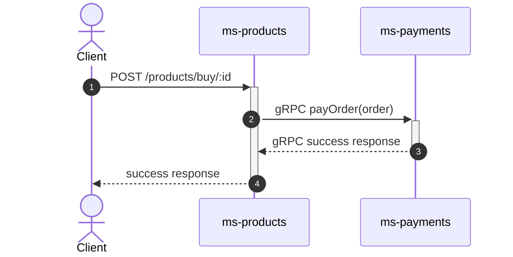

# Nest.js Microservices with gRPC

This repository contains a simple implementation of microservices using gRPC with Nest.js, structured as a monorepo and orchestrated with Docker Compose.

>This project follows the monorepo structure provided by Nest.js, for more information, refer to the [official documentation](https://docs.nestjs.com/cli/monorepo#monorepo-mode).

## Services

> The project consists of two services: `ms-payments` and `ms-products` located in the `apps` directory.

### `ms-products`

- **Type:** REST API and gRPC Client
- **Functionality:** The `ms-products` service provides a `/products/buy/:id` route that interacts with the `ms-payments` service and returns the response.

### `ms-payments`

- **Type:** gRPC Server
- **Functionality:** This service exposes a `payOrder` method that handles basic validations and returns a success response.

### Diagram


## API

> The `api` directory contains a `.rest` file with sample requests that can be executed using the REST Client extension for Visual Studio Code.

## Prerequisites

Before running the project, ensure you have the following dependencies installed on your machine:

- [Node.js](https://nodejs.org/)
- [Docker](https://www.docker.com/)

## Getting Started

To start the project, execute the following commands:

```bash
$ npm install && docker compose up -d
```

## Additional Resources

To generate TypeScript types from the `.proto` file `proto/payment.proto`, the `nestjs-proto-gen-ts` package was utilized. To replicate this, run the following command from the project's root directory:

```bash
$ npx tsproto --path ./proto
```